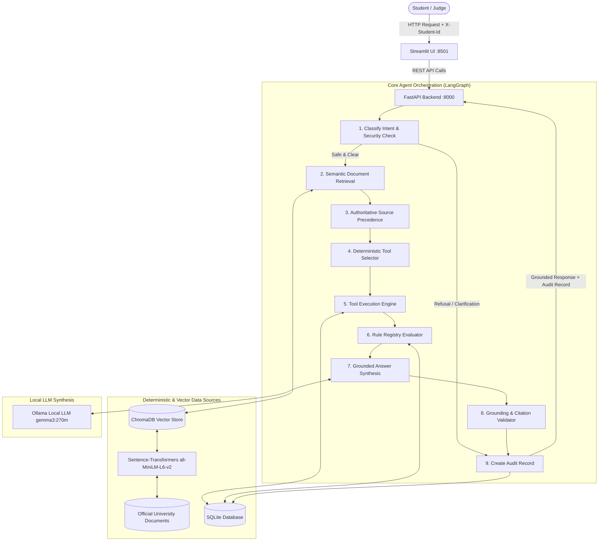

# System Architecture & Technical Specifications

## 1. High-Level Architecture Overview

The **AI-Powered University Student Services Assistant** is engineered around the principle that **the LLM is never the source of truth**. Ground truth originates strictly from official university publications (indexed in ChromaDB), student academic databases (SQLite), and the deterministic rule registry.



---

## 2. Layered Production Backend Architecture

The application implements a clean layered architecture with strict separation of responsibilities:

```text
app/
├── core/                        # Infrastructure, Config, Security, Logging, Domain Exceptions
│   ├── config.py                # Pydantic BaseSettings, directory management, cached settings
│   ├── logging.py               # Structured production logger with context tracking
│   ├── security.py              # Identity isolation, prompt injection scanning, upload validation
│   └── exceptions.py            # Typed domain exceptions mapped to HTTP response codes
│
├── schemas/                     # Strict Pydantic Data Contracts & Enums
│   ├── common.py                # Enums (AnswerType, ExamType) & Citation schemas
│   ├── requests.py              # Validated input contracts (AskRequest, IngestRequest)
│   └── responses.py             # Strongly typed API responses (AskResponse, HealthResponse, etc.)
│
├── database/                    # Connection Management & DDL Schemas
│   ├── connection.py            # SQLite connection pool, WAL mode, transaction context managers
│   └── models.py                # DDL scripts and table schema constants
│
├── repositories/                # Direct Data Access Layer (Parameterized & Injection-Safe)
│   ├── student_repository.py    # Student profile and course catalog lookups
│   ├── attendance_repository.py # Course-level & aggregate attendance lookups
│   ├── result_repository.py     # Examination marks and grade records
│   ├── rule_repository.py       # Regulatory rule definitions from rule_registry
│   └── audit_repository.py      # Immutable audit trace storage & historical retrieval
│
├── services/                    # Pure Domain Business Logic
│   ├── source_resolution.py     # Deterministic 5-tier precedence, supersession & conflict detection
│   ├── eligibility_service.py   # Deterministic regular & supplementary exam eligibility evaluator
│   ├── citation_service.py      # Authoritative citation formatting, markdown render, deduplication
│   ├── grounding_service.py     # Query presence keyword validation & canonical abstention fallback
│   └── audit_service.py         # Request latency tracking & structured audit record creation
│
├── tools/                       # Deterministic Tool Interfaces (Invoked by LangGraph)
│   ├── student.py               # Student profile retrieval tool
│   ├── attendance.py            # Attendance percentage calculation tool
│   ├── results.py               # Exam result retrieval tool
│   ├── eligibility.py           # Multi-metric eligibility calculator tool
│   └── policy.py                # Course lookup tool
│
├── rag/                         # Retrieval-Augmented Generation Components
│   ├── vector_store.py          # Persistent ChromaDB client and cosine index manager
│   ├── embeddings.py            # Sentence-Transformers all-MiniLM-L6-v2 singleton embedder
│   ├── retriever.py             # Semantic document query interface with score normalization
│   ├── chunking.py              # Section-aware document parser (PDF, DOCX, TXT, MD)
│   ├── citations.py             # Citation re-export layer
│   └── ingest.py                # Batch and live document ingestion pipeline
│
├── agent/                       # LangGraph Orchestration & Decision Engine
│   ├── state.py                 # Fully typed AgentState TypedDict
│   ├── graph.py                 # StateGraph compiled pipeline with early-exit branching
│   ├── prompts.py               # Grounded prompt templates & resilient Ollama client with fast connect timeout
│   └── nodes/                   # Modularized Single-Responsibility Pipeline Nodes
│       ├── intent_node.py       # Node 1: Intent & security classification
│       ├── retrieval_node.py    # Node 2: Semantic vector retrieval
│       ├── source_resolution_node.py # Node 3: Precedence resolution
│       ├── tool_node.py         # Node 4 & 5: Tool selection and execution
│       ├── rule_node.py         # Node 6: Rule registry evaluation
│       ├── synthesis_node.py    # Node 7: Grounded answer synthesis
│       ├── grounding_node.py    # Node 8: Grounding verification
│       └── audit_node.py        # Node 9: Audit log creation
│
└── api/                         # FastAPI Routers & Dependencies (HTTP Layer Only)
    ├── dependencies.py          # Header authentication extraction & validation
    ├── ask.py                   # POST /ask
    ├── health.py                # GET /health
    ├── sources.py               # GET /sources
    ├── student.py               # GET /student/{id}, POST /seed
    ├── ingest.py                # POST /ingest
    └── audit.py                 # GET /audit/{trace_id}, GET /audit
```

---

## 3. Nine-Node LangGraph Orchestration Pipeline

| Step | Node Name | Purpose & Behavioral Guarantees |
| :--- | :--- | :--- |
| **1** | `classify_intent` | Inspects privacy boundaries (`X-Student-Id` isolation), scans for prompt injection patterns, identifies target courses (`CS201`, `EC201`, etc.) and determines required intent. Early-exits safely on violations. |
| **2** | `retrieve_documents` | Queries ChromaDB for top semantic chunks, defangs any prompt injection patterns in retrieved text via the document safety layer. |
| **3** | `source_resolution` | Executes `resolve_authoritative_sources` enforcing the 5-tier hierarchy, temporal bounds, scope specialization, and conflict detection. |
| **4** | `select_tool` | Maps required intent to deterministic tool calls (`get_student`, `get_attendance`, `get_result`, `check_exam_eligibility`). |
| **5** | `execute_tool` | Queries SQLite deterministically to compute exact percentages and student standings without invoking the LLM. |
| **6** | `evaluate_rules` | Evaluates dynamic rules from `rule_registry` in SQLite (e.g. `ATT-MIN-01`, `SUPP-ELIG-ATT`, `SUPP-ELIG-BACKLOG`). |
| **7** | `synthesize_answer` | Generates a grounded, natural-language explanation strictly citing official document sections, version, and tool outputs. |
| **8** | `validate_grounding` | Verifies that citations exist, no hallucinations occurred, and enforces the standard abstention string if facts are absent. |
| **9** | `create_audit_record` | Logs trace ID, latency, sources, tools, rules, and answer into SQLite `audit_log` without storing intermediate chain-of-thought. |

---

## 4. Document Authority & Precedence Resolution Hierarchy

Documents are categorized across 5 distinct authority tiers:

| Authority Level | Document Classification | Examples |
| :---: | :--- | :--- |
| **Level 1 (Highest)** | Statutes, Ordinances, Academic Regulations | `ACAD-REG-2024` (v3.1), `EXAM-REG-2024` (v2.5) |
| **Level 2** | Official Circulars, Notifications, Authorised Policies | `ATT-POL-2024` (v2.0), `SUPP-EXAM-2024` (v1.8) |
| **Level 3** | Departmental Notices & Guidelines | `DEPT-CS-2024` (v1.2) |
| **Level 4** | Student Handbooks & Campus FAQs | `HANDBOOK-2024` (v4.0) |
| **Level 5 (Untrusted)** | Student Forums, Social Media & Unofficial Content | `UNOFF-FORUM-2024` (v0.9) |

### Resolution Algorithm:
1. **Active Effective Date:** Excludes expired documents (`as_of_date > effective_to`) or premature documents (`effective_from > as_of_date`).
2. **Scope Match:** Prefers policies specifically scoping the student's programme (e.g. `B.Tech CSE`) or batch.
3. **Explicit Supersession:** When document A specifies `supersedes: B`, document B is disqualified regardless of its historical status.
4. **Authority Dominance:** Higher authority tiers supersede lower tiers when scopes overlap.
5. **Enactment Recency:** When authority levels are equal, the more recently effective policy wins.
6. **Conflict Flagging:** If two policies of equal tier contradict each other without supersession, the system flags `answer_type = "conflict_flagged"`.
